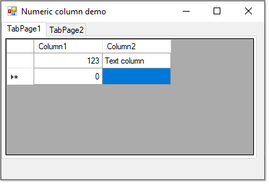

# About

Simple example for a numeric column for a DataGridView.

:small_blue_diamond: [Original source](http://www.codeproject.com/Articles/31309/Custom-Numeric-Edit-Elements-for-DataGridView) so if you have question post them there.

